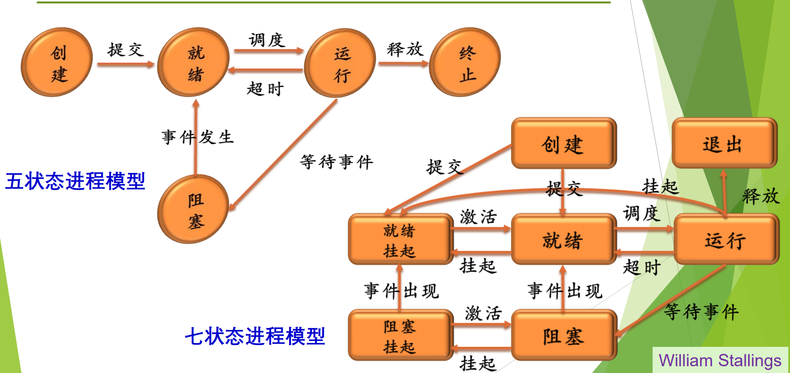
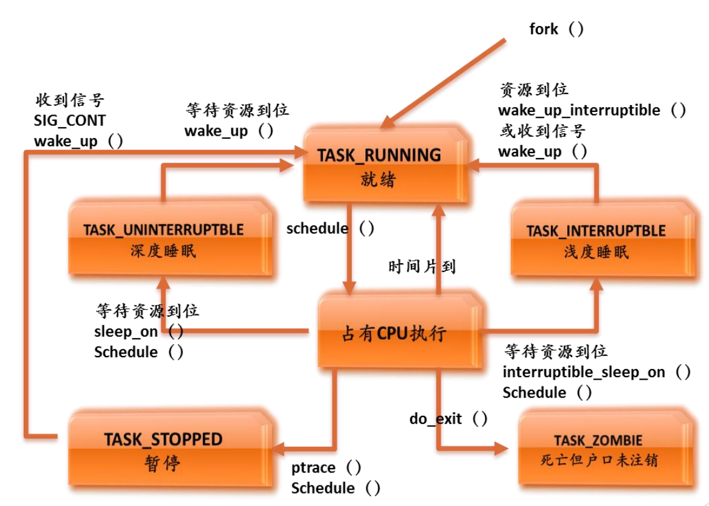
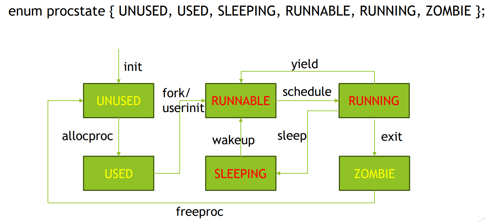
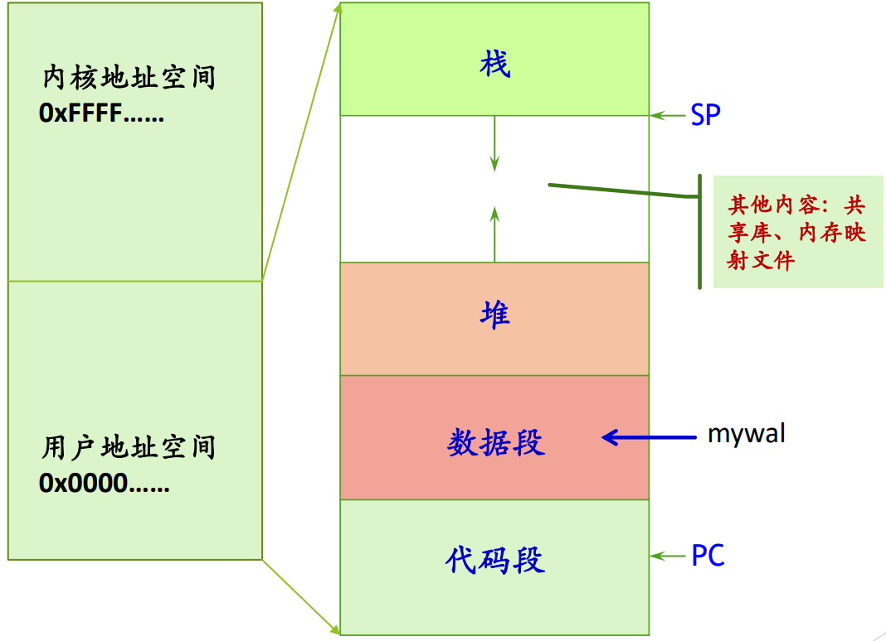

# 操作系统核心模块：进程与线程模型 (Process & Thread Models)

## 📌 第一部分：并发环境与进程概念 (Basic Concepts)

### 1. 顺序环境 vs 并发环境

- **顺序程序环境**：具有**封闭性**（独占资源，不受外界影响）和**可再现性**（运行结果与执行速度无关）。系统中只有一个程序在运行。
- **并发程序环境**：一段时间内单处理器上有两个或以上程序开始运行且未结束。
    - **核心特征 (考点)**：**间断性**（执行-停-执行）、**资源共享**、独立性与制约性、**不可再现性**（执行结果不再唯一确定）。

### 2. 进程 (Process) 的本质

- **经典定义**：程序的一次执行过程，是**对 CPU 的抽象**。
- **核心功能**：进程是具有独立功能的程序在某个数据集合上的一次运行活动，是**系统进行资源分配和调度的独立单位**。
- **进程映像 (Process Image)**：通常包含 程序代码 + 数据集合 + 栈 + 进程控制块 (PCB)。
- 特性：并发性、动态性（动态产生消亡、在生命周期内三种基本状态转换、动态地址空间）、独立性（资源分配的独立单位，不同进程之间不影响）、制约性（可能与其他进程产生直接间接关系、因访问共享数据/资源或进程间同步而产生制约）、异步性（以相对独立且不可预知的速度向前推进）

### 3. 补充内容

- UNIX进程家族树：init为根；WIndows：地位相同

---

## 📌 第二部分：进程状态流转与 PCB (State & PCB)

### 1. 进程状态模型 (Process State Models)

- **三状态模型 (最经典)**:
    - **运行态 (Running)**：占有 CPU 并在 CPU 上运行。
    - **就绪态 (Ready)**：具备运行条件，但因没有空闲 CPU 暂时不能运行。
    - **阻塞/等待态 (Waiting/Blocked)**：因等待某一事件（如 I/O、消息）而不能运行。
- **五状态/七状态模型 (扩充)**：引入了**创建 (New)**、**终止 (Terminated)**。七状态更引入了**挂起 (Suspend)** 状态（将进程映像从内存交换到磁盘上，以调节负载或回收内存）。
    
    
    
- **💡 特殊 OS 的状态考点**：
    - **Linux 状态**：`TASK_RUNNING` (就绪/运行态), `TASK_INTERRUPTIBLE` (浅度睡眠), `TASK_UNINTERRUPTIBLE` (深度睡眠), `TASK_STOPPED` (暂停), `TASK_ZOMBIE` (僵尸态：死亡但户口未注销)。
        
        
        
    - **xv6 状态**：`UNUSED`, `USED`, `SLEEPING`, `RUNNABLE`, `RUNNING`, `ZOMBIE`。
        
        
        

### 2. 进程控制块 (PCB，又称进程描述符、进程属性)

- **定义**：操作系统中表示进程的数据结构，是**系统感知进程存在的唯一标志**。
- PCB存放在进程空间的内核数据段部分，相当于cpu对这个进程的句柄。
- **进程表**：所有进程的PCB的集合。
- **Linux**：task_struct； WIndows：EPROCESS、KPROCESS、PEB（分了三块地方放PCB）
- **三大核心信息块**：
    1. **进程描述信息**：PID、进程名（通常基于可执行文件名）、User ID。
    2. **进程控制信息**：当前状态（`enum procstate`）、优先级、代码执行入口地址、可执行文件名（磁盘地址）、运行统计信息（执行时间页面调度）、进程间同步和通信、阻塞原因、进程的队列指针、进程的消息队列指针。
    3. **所拥有的资源和使用情况**：虚拟地址空间的现状、打开文件列表
    4. **CPU 现场信息 (Context)**：通用寄存器值、PC、状态PSW、栈指针、指向赋予该进程的段/页表的指针。

---

## 📌 第三部分：内存地址空间与进程控制 (Address Space & Control)

### 1. 进程的虚拟地址空间

- **构成 (低地址到高地址，注意一般不是从0x0开始——防止野指针)**：代码段 (Text) -> 数据段 (Data) -> 堆 (Heap, 向上增长) -> 内存映射区/共享库 -> 用户栈 (Stack, 向下增长) -> 内核空间。
    
    
    
- **Linux 的内存数据结构**：
    - 顶层 `task_struct` 包含 `mm` 指针。
    - `mm_struct` 包含硬件命脉 `pgd`（页全局目录基址，x86体系中是CR3存放，给 MMU 用的）和软件命脉 `mmap`。
    - `mmap` 指向一系列 `vm_area_struct` 节点（链表），每个节点代表一块虚拟地皮（如数据段、代码段），记录了 `vm_start`, `vm_end` 和 `vm_prot` (读写权限)。
    - MMU在翻译虚拟地址时，查到任一级页表项的valid=0或权限不一样，则顺着vm_area_struct表寻找这段虚拟地址对应的vm_area_struct，看看是否有关COW机制
    - malloc的过程：
        1. 判断分配大小：size≤阈值（128KB）用brk调整堆大小分配；size>阈值用mmap匿名映射分配
        2. 小内存：
            1. 找空闲链表，找到则直接切分使用不进内核
            2. 找不到则调用brk扩展堆顶
            3. 内核更新虚拟地址空间
            4. 返回内存指针
        3. 大内存：
            1. 直接用mmap
            2. 在进程虚拟空间单独分配一块内存
            3. 不在堆内（在stack下heap上的shared libraries and huge malloc blocks）
            4. 返回指针
- 进程表（队列）：队列分为（就绪1、就绪2、……等待1、等待2……），PCB在不同队列中转换
    - 单CPU中运行队列只有一个PCB
    - 不同PCB等待不同的事件，进入不同的等待队列

### 2. 进程创建与撤销

- **原语 (Primitive)**：具有不可分割性/原子性的操作，执行过程不允许被中断。
- **进程何时创建**：系统初始化、操作系统提供的服务、交互用户登录系统、由现有的进程派生、提交一个程序执行（例如：命令行）
- **进程的创建**：
    - 给新进程分配一个唯一标识(pid)以及进程控制块(PCB)
    - 为进程分配地址空间
    - 初始化进程控制块
    - 设置默认值（如：状态为 New，......）
    - 设置相应的队列指针（如: 把新进程加到就绪队列的链表中）
    - 创建或扩充其他数据结构
- **UNIX 进程控制 API**：
    - `fork()`：通过复制调用进程来建立新进程。
    - `exec()`：用一段新代码覆盖原来的内存空间，实现代码转换。
    - `wait()`：同步措施，等待另一个进程（通常是子进程）结束。
    - `exit()`：终止进程。

### 3. 🔥 核心考点：写时复制技术 (COW, Copy-On-Write)

- **问题**：`fork()` 时如果把父进程内存一页页全拷贝，极度浪费空间和时间。
- **机制**：
    1. `fork` 后，子进程获得 `mm_struct`, `vm_area_struct` 和页表的精确副本。
    2. 内核将父子进程的页表中的页面全部标记为**只读 (Read-Only)**。
    3. 内核将父子进程的 `vm_area_struct` 标记为 **私有 COW**。
    4. 子进程状态设为**就绪**，插入就绪队列。
    5. **缺页异常介入**：当任何一方尝试写入时，硬件 MMU 拦截到写只读页的操作，触发异常。操作系统此时才会在物理内存中复制该页面，并将新页面的映射权限恢复为可写。

---

## 📌 第四部分：线程模型 (Thread Model)

### 1. 为什么引入线程？

- **分离进程的两大属性**：进程原本既是“资源拥有者”又是“调度单位”。引入线程后，**进程**专注于资源的分配与保护（拥有虚拟地址空间），*而**线程**成为 CPU 的调度单位和运行实体*。
- **优势 (考点)**：
    - 应用需求：如 Web 服务器可以利用多线程实现“接收请求”与“读取磁盘”并发执行，响应速度极快。
    - 开销极小：线程创建、撤销远比进程快；同一进程内的线程切换无需切换页表，极快。
    - 通信便捷：线程之间共享内存和文件，通信无需调用内核。
    - 性能：能充分利用多核、多处理器的并行计算能力。

### 2. 线程私有与共享的资源

- **私有资源**：程序计数器 (PC) 及寄存器、用户栈、内核栈、线程控制块 (TCB)。
- **共享资源 (同进程内)**：用户地址空间（代码段、数据段、堆）、打开的文件、全局变量。

### 3. 线程的实现机制 (三大模型)

1. **用户级线程 (ULT, User Level Thread)**：
    - 在用户空间通过线程库（如**POSIX Pthreads**）实现，内核完全不知道线程的存在。
    - **优点**：切换无需陷入内核态，速度极快；调度算法可由用户自定义；可跑在任何OS上。
    - **致命缺点**：一个线程发起阻塞系统调用，内核会将整个进程挂起，导致同进程内所有线程全部阻塞；内核只分配一个CPU给该进程，多线程就无法利用多核 CPU 优势。
2. **核心级线程 (KLT, Kernel Level Thread)**：
    - 内核管理所有线程，维护线程上下文（如 Windows），线程切换需要内核支持。
    - **特点**：以线程为基础进行调度，支持多核并行，一个线程阻塞不影响其他线程。但切换需陷入内核态，开销比 ULT 大。
3. **混合模型 (Hybrid)**：
    - 线程创建在用户空间完成，调度在核心态完成。多个用户级线程多路复用在多个内核级线程上（如 Solaris）。

### 4. 协程 (Coroutine) 与纤程 (Fiber)

- **协程**：一种在**用户态（不陷入内核）**模拟的更轻量级的执行流，强调“协作式”而非抢占式放弃 CPU，用于改善高并发（Web、API网关）、异步 I/O（数据库访问、MySQL等客户端文件读写、爬虫请求）、UI交互与事件驱动程序前端、批量并发请求聚合等 的编程性能（如 Go 的 Goroutine）。
- **纤程**：Windows 系统提供的机制，一个线程中可以有多个纤程。