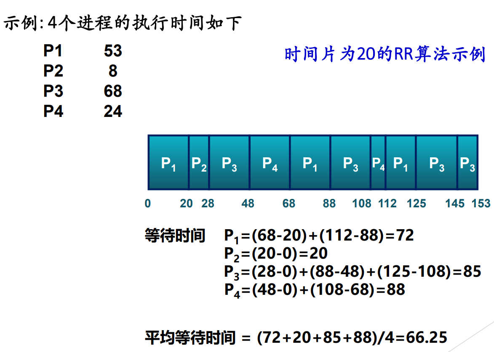

# 操作系统：进程与线程调度核心考点全梳理

---

## 零、核心概念：调度的三个层次

- **长程调度 (Long-term / 作业调度)**：控制多道程序的“并发度”。决定新创建的进程是否进入当前活跃进程集合。
- **中程调度 (Medium-term / 交换调度)**：涉及虚拟内存与物理内存的置换。将部分或全部进程换出(挂起状态)到外存以腾出内存空间，或将所需部分换入内存。
- **短程调度 (Short-term / 微观调度)**：决定就绪队列中哪个进程/线程上CPU运行。时间尺度为“毫秒级”，要求极高的执行效率。

## 一、调度时机与上下文切换

- **触发时机**：进程退出、异常终止、新创建进程、I/O阻塞或等待资源、唤醒进程后重新回到就绪态、时间片用完回到就绪队列、执行 yield。Linux和xv6中，当进程read阻塞，另一个进程执行中io任务完成，将在另一个进程当前一条指令执行结束后处理中断，然后会重新调度进程。
- **黄金法则**：所有调度逻辑的真正执行，都发生在**内核对中断/异常/系统调用处理完成后，返回到用户态前的最后时刻**。事件发生 → 当前运行的进程暂停运行 → 硬件机制响应后→ 进入操作系统，处理相应的事件 → 结束处理后：某些进程的状态会发生变化，也可能又出现了一些新的进程→ 就绪队列有调整 → 需要进程调度根据预设的调度算法从就绪队列选一个进程
- **上下文切换 (Context Switch) 步骤**：
    1. 保存进程A硬件状态（PC、PSW、通用寄存器）至其 PCB（在x86中是软硬结合保存）。
    2. 给进程A设置新状态，并将A的PCB移至合适的队列（就绪、阻塞）。
    3. 把进程B的状态设置为运行态。
    4. 切换全局页目录（`CR3` —x86/ `satp` —RISCV）加载新进程B的物理地址空间。
    5. 切换内核栈（修改栈指针寄存器存放的内容，进程B的栈指针在PCB中记录，**注意这里是虚存**）和硬件上下文，从新进程的 PCB 中恢复寄存器状态。
- **性能开销**：直接开销为保存/恢复寄存器及切换地址空间的指令耗时；间接开销（致命）为 Cache、Buffer Cache 及 TLB（快表）的清空与失效重载。

### 调度算法的设计指标

- **吞吐量 (Throughput)**：单位时间完成的进程数目。
- **周转时间 (Turnaround Time, TT)**：从提出请求到运行完成的总时间。
- **响应时间 (Response Time, RT)**：从提出请求到系统给予**第一次**回应的时间（交互式系统核心指标）。
- **进程分类考量**：I/O密集型 (I/O-bound，需快速响应) 与 CPU密集型 (CPU-bound，需大时间片)。

---

## 二、各类经典调度算法深度解析

### 0. 不同操作系统的目标

- **交互式进程**（eg：shell、文本编辑程序）：响应时间、均衡性
- **批处理进程**（eg：利息计算等不必与用户交互且不必很快响应）：吞吐量、周转时间、CPU利用率
- **实时进程**（eg：视频音频等有实时需求、不应被低优先阻塞）：最后期限、可预测性

### **1. 先来先服务 (FCFS - First Come First Serve)**

- **机制**：按进入就绪队列的顺序调度，**非抢占**。
- **考点**：**优点**对长进程有利，**缺点**对短进程极度不利。不利于用户的交互式体验。会导致 CPU 型进程长期霸占 CPU，使得后续 I/O 型进程无谓等待，降低设备利用率。

### **2. 短作业优先 (SJF - Shortest Job First) & 最短剩余时间优先 (SRTN)**

- **机制**：挑选预期运行时间最短的执行。SJF 为**非抢占**式；SRTN 为**抢占**式（新来更短的直接剥夺当前进程）。
- **考点**：数学上能得出**理论最优的最短平均周转时间**。致命**缺点**是会导致长作业“饥饿 (Starvation)”，且在现实中极难准确预测进程未来需要的运行时间。

### **3. 最高响应比优先 (HRRN - Highest Response Ratio Next)**

- **公式**：$响应比 R = 1 + (作业等待时间 / 作业处理时间)$。
- **考点**：完美折衷。短作业由于处理时间极小，R值大，易被调度；长作业随着等待时间线性增长，R值也会逐渐变大，最终被调度，有效避免了饥饿。**缺点**：需频繁计算，资源开销大。

### **4. 时间片轮转 (RR - Round Robin)**

- **机制**：排成循环队列，每次执行一个时间片（Quantum），用完被时钟中断强制剥夺放到队尾。
- **考点**：时间片过长则退化为 FCFS；过短则上下文切换开销占比过高。RR 对相同大小的进程其实“非常不友好”（会导致所有进程同步拖到最后时刻才完成，平均周转时间甚至劣于 FCFS）。

### **5. 虚拟轮转法 (VRR - Virtual RR)**

- **机制**：为每个进程设置一个固定的时间片，CPU上时间片用完以后就切换。
- **优缺点**：有利于交互式计算、公平；但轮换算法要花费较高开销，不利好相同大小的进程。
    
    
    
- 为了补偿由于 I/O 阻塞而提前放弃 CPU 的进程，设立了一个**辅助队列 (Auxiliary Queue)**。
- **考点**：I/O 唤醒后的进程直接进入高优先级的辅助队列，而不是普通就绪队列，保证 I/O 密集型进程能及时获得 CPU 发起下一次 I/O。

### **6. 最高优先级调度**

1. 排序：系统进程>用户进程；前台进程>后台进程；操作系统更偏好I/O型。
2. 优先级反转问题：
    - **现象**：高优先级 (H) 等待低优先级 (L) 释放锁，而 L 又被中优先级 (M) 抢占，导致 H 被实质性挂起。
    - **解法**：优先级天花板协议（把L临时提到最高）、优先级继承机制（H让出优先级给L使用）、关闭中断（L不允许被打断）。

### 7. 多级反馈队列调度（MLFQ）

- 算法实现（非抢占式）：
    - 设置多个就绪队列，第一级队列优先级最高
    - 给不同就绪队列中的进程分配长度不同的时间片，第一级队列时间片最小；随着队列优先级别的降低，时间片增大
    - 当第一级队列为空时，在第二级队列调度，以此类推
    - 各级队列按照时间片轮转方式 进行调度
    - 当一个新创建进程就绪后，进入第一级队列
    - 进程用完时间片而放弃CPU，进入下一级就绪队列（被时钟中断强行叫停trap）
    - 由于阻塞而放弃CPU的进程（主动yield）进入相应的*等待队列*，一旦等待的事件发生，该进程回到**原来一级**就绪队列
    - 当有一个优先级更高的进程就绪时，可以**抢占**，被抢占的进程回到原来一级就绪队列末尾

---

## 三、真实操作系统调度实现拆解

### 1. Windows 线程调度机制

- **基本架构**：基于 32 级**动态优先级**的**抢占式多任务**调度，结合时间配额（Quantum）调整。
    - 16 ~ 31 级：实时优先级（绝对不改变，一般是操作系统线程）。
    - 1 ~ 15 级：可变优先级（根据行为动态升降）。
    - 0 级：系统零页线程（仅在无其他线程时运行，负责物理页清零）。
- **数据结构**：维护 32 位的**就绪**位图 (Ready Bitmap)，以及一个32位的空闲位图，每一位指示一个处理机是否处于空闲，$O(1)$时间内找到最高非空队列。
- **调度策略**：（优先级改变/亲和处理机改变时触发调度）
    - 进程在运行态主动yield进入阻塞态。
    - 抢占：高一级的进程从阻塞态被唤醒（中断处理后修改状态），原有运行的低级进程回到原级别就绪队列的队首。处于实时优先级的，时间配额重置为完整；可变优先级继续运行剩余的配额。
    - 时间配额用完：A优先级没降低——原队列有其他进程则将A放置队尾，否则A继续运行；A优先级降低了——将选择一个优先级更高的进程。
- **优先级动态提升（Bonus）**：
    - I/O 操作完成时（临时提升等待该操作线程的优先级，并在唤醒等待线程时把时间配额减一，响应要求越高，提升幅度越大）。
    - 等待事件/信号量结束时（提升该线程一个优先级但不会超过15级，时间配额减一，在提升后的优先级上运行完剩余时间配额，降低一个优先级，运行新的时间配额，直至降低到基本优先级）。
    - 前台进程中的线程完成了一个等待操作。
    - 前台窗口活动被唤醒时（eg：鼠标点击）。
    - **防饥饿**：平衡集管理器 (Balance Set Manager) 每秒扫描，排队超 300 个时钟间隔的线程，被强行提升至 15 级并赋予 4 倍时间配额，用完后立即衰减回原点。
- 空闲线程：如果有待处理的DPC请求，清除相应软中断并执行DPC；若线程就绪则调度相应线程；执行相应的电源管理功能。

### 2. Linux 调度器的史诗级演进

这是考试极其容易考察的内核演进脉络！

- **Linux 2.4 调度器（O(N) 遍历）**
    - 单队列，基于 `counter` + `nice` 值，越低越优先。当所有就绪进程的 `counter` (时间片) 都耗尽后，产生一个 $O(N)$的全员重新计算过程。
    - 睡眠进程醒来时，保留其未用完的 `counter` 并叠加新配额，借此提升交互进程优先级。性能和扩展性极差。
    - 实时进程的counter用完之后会立刻重置counter然后放入就绪队列，而非实时进程要等待runqueue中为空时，统一重新计算counter
- **Linux 2.6 O(1) 调度器**
    - 设计双数组：`active` (存很多优先级队列) 和 `expired` (过期队列)。
    - 选取`active`中最高优先级，进程时间片耗尽，若为交互式进程或实时进程，则重置时间片并重新插入`active`中，否则直接扔进 `expired`。当进程已经占用CPU足够长时，就全部扔进`expire`。当 `active` 为空时，仅需交换两个数组的指针，实现$O(1)$开销。
    - 依靠极其复杂的经验公式（睡眠时间越长，bonus越大）来给交互式进程计算 Bonus，实时进程的优先级不会动态修改，总比普通进程高。
- **SD (Staircase Scheduler) 楼梯调度**
    - 对于实时进程还是FIFO/RR策略。
    - 时间片用完**降级**到`active`数组中低一优先级的队列中。降到底部后回到原始级别的下一级，并获得N+1倍时间片。
- **RSDL (Rotating Staircase Deadline)**
    - 给每一个优先级设立了“组时间配额 (Tg)”。一旦高优先级组的 Tg 耗尽，无论组内个别进程的时间片 (Tp) 是否用完，**全组被强制踢下楼梯** (Minor Rotation)。此外，一个进程自己的时间片用完，放到同级别的`expired`数组中，若所有进程都用完或者都到了最低层，则交换。
    - 使得底层的饥饿进程能在一个“可精确预期的 Deadline 内”获得调度权。
- **CFS (Completely Fair Scheduler) 现代 Linux 王者**
    - **核心思想**：彻底废除静态时间片，按权重比例分配 CPU 物理时间。
    - **核心公式**：虚拟运行时间 (vruntime) = （调度周期*进程权重/所有进程总权重） * NICE_0_LOAD / 进程权重。
    - **数据结构**：所有进程被挂载在**红黑树**中，调度器永远挑选最左下角（`vruntime` 最小）的节点执行。
    - **唤醒补偿**：维护一个全局变量 `min_vruntime`，睡眠进程唤醒时，将其 `vruntime` 补偿至接近 `min_vruntime` 的值，使其一醒来就因值较小而立刻抢占 CPU。

### 3. 多核与实时调度机制

- **实时调度**：
    - **可调度性前提**：$sum_{i=1}^{m} (C_i / P_i) \le 1$($C$为处理耗时，$P$ 为事件$i$发生的周期)。
    - **RM (速率单调)**：静态优先级，执行时间越短优先级越高。
    - **EDF (最早截止时间优先)**：动态优先级，距离 Deadline 越近优先级越高。
- **多核机制**：
    - **缓存亲和性 (Cache Affinity)**：调度器尽量将进程绑定在曾经运行过它的物理 Core 上，避免 L1/L2 Cache 大面积失效 (如 Go语言 GMP 调度器机制)。
    - **负载均衡机制**：openEuler 系统使用专门的迁移线程 (`migration/CPUID`) 强制将进程从过载 CPU 的队列“窃取 (Work Stealing)”至空闲 CPU 队列中。
    - **缓存一致性**：有两个处理器同时读取并修改共享数据（解决：MESI协议）
- **YARN调度流程**：
    
    1）客户端提交任务→RM  2)RM给这个应用启动一个AM  3）AM向RM申请资源（container）  4）RM把可用节点/资源返回给AM  5）AM命令对应节点的NM启动container运行任务  6）NM监控执行，AM监控整个应用  7）结束→AM退出，资源回收
    

---

## 附录：跨体系调度策略总对比一览表

| 调度算法名称 (中英文) | 英文简写 | 调度决策方式 | 核心设计思想 / 优先级测算方式 | 适用场景 / 优缺点特征 |
| --- | --- | --- | --- | --- |
| **先来先服务**  First Come First Served | **FCFS** | 非抢占式 | 绝对按进入就绪队列的时间先后排队。 | 对长作业极度有利，极度压榨 I/O 密集型程序，不利于交互。 |
| **最短作业优先**  Shortest Job First | **SJF** | 非抢占式 | 预估运行时间最短的优先调度执行，直到阻塞或完成。 | 拥有理论最低平均周转时间，但容易导致长作业饿死。 |
| **最短剩余时间优先**  Shortest Remaining Time Next | **SRTN** | 抢占式 | SJF 的抢占版本，新到达任务如果比当前任务剩余时间短，立即剥夺。 | 为短进程提供极佳响应，但强依赖运行时间预测。 |
| **最高响应比优先**  Highest Response Ratio Next | **HRRN** | 非抢占式 | 动态计算响应比 `R = 1 + (WaitTime / ServeTime)`。 | 完美折衷：短任务天生 R 高；长任务随等待时间增长 R 变高，杜绝饥饿。 |
| **时间片轮转**  Round-Robin | **RR** | 抢占式 (时间片耗尽) | 系统划分时间片配额 $q$，所有进程同等分配，耗尽即踢至队尾。 | 对交互计算公平友好；缺点是频繁上下文切换开销巨大。 |
| **虚拟轮转**  Virtual Round-Robin | **VRR** | 抢占式 | RR的变种，为 I/O 阻塞苏醒的进程设立专有高优先级辅助队列。 | 解决 RR 无法充分照顾 I/O 密集型进程使其丧失 CPU 利用率的痛点。 |
| **最高优先级优先**  Highest Priority First | **HPF** | 抢/非抢占 皆可 | 赋予静态或动态优先级，严格优先调度最高级别。 | 易导致低优先级极度饥饿及“优先级反转”灾难。 |
| **多级反馈队列**  Multilevel Feedback Queue | **MLFQ** | 抢占式 | 设立多级队列。Q1 优先级最高时间片极短。耗尽时间片则向下降级沉底。 | 现代 OS 的根基。完美识别短交互与长计算：短任务在顶层极速完成，长任务在底层吃大时间片。 |
| **完全公平调度器**  Completely Fair Scheduler | **CFS** | 抢占式 | 彻底抛弃队列，构建红黑树。按权重分配 CPU 虚拟运行时间 (`vruntime`)。 | Linux 现役王者。用最纯粹的数学比例实现真正的时间公平。 |
| **速率单调调度**  Rate-Monotonic | **RM** | 抢占式 (静态) | 实时系统专属。任务周期（Period）越短，赋予的静态优先级越高。 | 经典硬实时调度，易于实现验证，基于强周期性假设。 |
| **最早截止时间优先**  Earliest Deadline First | **EDF** | 抢占式 (动态) | 实时系统专属。距离 DeadLine 最近的任务瞬间获得最高优先级。 | 动态计算开销大，但在可行性条件下能保证100% 任务按期完成。 |
| **工作窃取调度**  Work Stealing | - | 多核均衡机制 | 空闲 CPU 主动去繁忙 CPU 的待执行队列末尾“偷”任务执行。 | 多核时代的并行王者算法，平衡了 Cache 亲和性与 CPU 整体吞吐量。 |